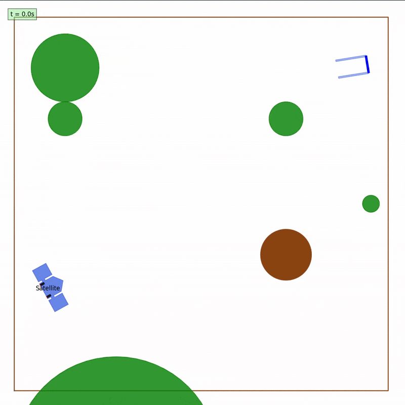

# Autonomous Satellite Docking

This repository contains our implementation of the final project for the [**Planning and Decision Making for Autonomous Robots (PDM4AR)**](https://idsc.ethz.ch/education/lectures/PDM4AR.html) course at **ETH Zurich** by **Prof. Emilio Frazzoli**.

<p align="center">
  
</p>

The project implements a motion planning framework for autonomous satellite navigation. It utilizes **Successive Convexification (SCvx)** to guide a satellite through a dynamic environment while avoiding planets and moving asteroids to execute a precision landing at a target docking station.

## Algorithm
The core trajectory generation algorithm is based on **Successive Convexification (SCvx)**, a method for solving non-convex optimal control problems by solving a sequence of convex subproblems.

The implementation follows the methodology described in:

> [**Convex optimization for trajectory generation**](https://arxiv.org/pdf/2106.09125)
> *Malyuta, Danylo et al.*
> arXiv preprint arXiv:2106.09125, 2021.

### Methodology
The satellite docking problem is inherently non-convex due to nonlinear dynamics and collision avoidance constraints. The SCvx algorithm addresses this through the following steps:

1. **Linearization & Discretization:** The continuous nonlinear dynamics are linearized around a reference trajectory and discretized using First-Order Hold (FOH) to ensure physically realizable control inputs.

2. **Convex Subproblem Formulation:** Non-convex constraints (such as obstacle avoidance) are approximated by convex constraints within a trusted region. This transforms the challenge into a convex optimization problem solvable by robust embedded solvers (e.g., ECOS or CLARABEL via CVXPY).

3. **Iterative Improvement:** The planner iteratively solves these convex subproblems, updating the reference trajectory at each step until convergence is achieved.

## Codebase Structure
The project is organized into modular components separating the agent's logic from the simulation environment:

* **`src/satellite_docking/agent/`**: Contains the autonomous agent's intelligence.

  * `planner.py`: The core **SCvx implementation**. Handles problem formulation, convexification logic, and the iterative solution loop.

  * `agent.py`: A wrapper class that interfaces with the simulation, processing observations and triggering the planner.

  * `discretization.py`: Utilities for discretizing continuous time dynamics.

* **`src/satellite_docking/simulation/`**: Defines the physics and environment.

  * `config_*.yaml`: Scenario definitions (initial states, goal states, obstacle configurations).

  * `ex13.py`: The main simulation loop and visualization rendering logic.

  * `models/`: Mathematical models for satellite dynamics and geometry.

* **`src/main.py`**: The entry point for executing the simulation.

## Running the Simulation

### Using Docker
1.  **Build the Docker image:**
    ```bash
    make build
    ```

2.  **Run the simulation:**
    ```bash
    make run
    ```
    The results (videos and plots) will be saved in the `out/` directory.

### Local Development
1.  Install dependencies:
    ```bash
    pip install -r requirements.txt
    ```

2.  Run the simulation:
    ```bash
    export PYTHONPATH=$PYTHONPATH:$(pwd)/src
    python src/main.py
    ```
